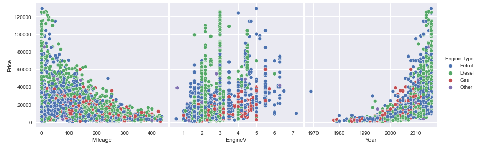

# Capstone-Project

## Project Overview

This is a multiple linear regression analysis to show which features has a high coefficient with the dependent variable. This study will use the OLS regression analysis to show which variable influences the car price.

### The Data

The variables are:

Dependent Variable:
* Price -  is prediction target

Predictors
* Brand - The brand and make of car
* Body - The body type of the selected make of car
* Mileage - The car travel mileage
* EngineV - The size and volume of car engine
* Engine Type - What fuels the car (Fuel, Diesel or Others)
* Registration - The car is registered or not
* Year - The year the car was built
* Model - The specific model of the make of car

The data can be found in Kaggle https://www.kaggle.com/datasets/smritisingh1997/car-salescsv

### Data Example
### Visual 1

### Business Objective

The aim of this study is to provide an understanding on the features that influence the car price. This will result in an effective price tag for the car, better marketing and result focused.

## Methodology

This analysis follows the OSEMN Data Science Process
OBTAIN
SCRUB
EXPLORE
MODEL
INTERPRET

## Result

Price is the dependent variable
18 Predictors
88.5% of variations explained in our model
Registered cars are the top predictor for car price
